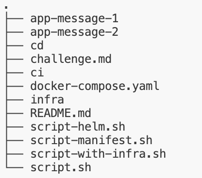
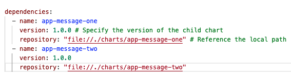

# About
This repo contains the Devops Infra Code challenge

## Dear applicant
Please see and follow instructions in [challenge.md](./challenge.md)

## Dear code challenge operator
To create the Code Challenge, follow the instruction in [README.md](https://github.com/signavio/hiring-tools/blob/master/README.md).
To evaluate the code challenge, you can use [this tool](https://github.com/signavio/grizzlies/blob/master/tools/evaluate_code_challenge/README.md).


This assignment creates two application as mentioned in [Challange]('https://github.com/signavio-hiring/coding-challenge-mayank/blob/main/challenge.md') 


## Solution to Challange

I have create two application

| App Name      | Tech Stack | Port  |
|---------------|------------|-------|
| app-message-1 | fastApi    | 8081  |


| App Name      | Tech Stack | Port  |
|---------------|------------|-------|
| app-message-2 | fastApi    | 8080  |

### Folder structure



Folder description:
| File/Folder      | Description |
|---------------|------------|
|**app-message-1/**| Contains the codebase of app-message api|
|**app-message-2/**| Contains the codebase of internal call to app-message-1 then reverse the logic |
|**cd/** | Contains the deployment file e.g. helm charts, manifest files, flux CRD and controllers |
|**ci/**| image building of both app1 and app2|
|**infra/**|Cluster provisioning with Kind|
|**docker-compose.yaml**|To test the application quickly without kubernetes|
|**script-helm.sh**|Install application via helm charts|
|**script-manifest.sh**|install application via manifest directly|
|**script-with-infra.sh**|install script with kind cluster creation|


I have solved the challange with 4 approaches 

### Approach 1 - Raw Kubernetes Manifest

#### Prerequisit
- Kind
- kubectl
- Docker
- Bash shell

For this approach I have create kubernetes manifest present in `cd/manifests` of both the application **app-message-1** and **app-message-2**  

**Note:** Kind cluster should be present before running the script

To build, deploy, and access the application, execute the following command:

```
./script-manifest.sh
```

You can access the application at: `http://0.0.0.0:8080/`


This command will:
- Build the image and push it to the Docker Hub repository.
- Deploy the manifest to the existing Kind cluster.
- Port-forward to the second application, app-message-2, so that it is accessible in the browser.
- api output in the console


### Approach 2 - Helm Chart approach

#### Prerequisit
- Kind
- kubectl
- Docker
- Bash shell
- helm

For this approach I have create helm chart present in `cd/helm` folder, details below:
 both the application **app-message-one** and **app-message-two** 2 charts is being create which is located in `cd/helm/parent-chart/charts` folder

 `cd/helm/parent-chart` is used to manage dependencies of both the chart, reason being **app-message-one** should get installed before **app-message-two** mentioned in image below, refer **Chart.yaml** from **parent-chart** for reference

 

**Note:** Kind cluster should be present before running the script

To build, deploy, and access the application, execute the following command:

```
./script-helm.sh
```

You can access the application at: `http://0.0.0.0:8080/`


This command will:
- Build the image and push it to the Docker Hub repository.
- Deploy the helm chart to the existing Kind cluster.
- Port-forward to the second application **app-message-one-app-message-two** so that it is accessible in the browser.
- api output in the console

### Approach 3 - GitOps based approach with Flux CD(Helm Chart) - In Progress

This approach is the most optimal solution to the challange

#### Prerequisit
- Kind
- kubectl
- Docker
- Bash shell
- helm(Optional on host machine)
- flux cli(Optional on host machine)


For this approach I am updating the github repo with a change that will trigger the deployment as flux source controller is listening to the changes in
the repository and applying the helm charts via Helm Controller of Flux
 both the application **app-message-one** and **app-message-two** 2 charts will get deployed with  `cd/helm/parent-chart/charts` folder

 `cd/helm/parent-chart` 


To build, deploy, and access the application, execute the following command:

```
./script.sh
```

You can access the application at: `http://0.0.0.0:8080/`


This command will:
- Build the image and push it to the Docker Hub repository.
- Install FluxCD CRD's and Controllers(Source Controller, Notification Controller, Helm Controller, Kustomize Controller)
- Deploy the helm chart to the existing Kind cluster.
- Port-forward to the second application **app-message-one-app-message-two** so that it is accessible in the browser.
- api output in the console


### Approach 4 - Docker Compose based approach

This approach is a quick solution to check the app is working in dev environment and do not required kubernetes

# prerequsit
- Docker

If you wish to build and run the application without Kubernetes, you can use the provided `docker-compose.yaml` script to run and build the application locally without a Kubernetes cluster.

Run
```
docker compose up --build
```


## API Calls - app-message-one

- **Base URL**: `http://0.0.0.0:8081/`
    - Response: `{"detail":"Not Found"}`

- **Ping Endpoint**: `http://0.0.0.0:8081/ping`
    - Response: `{"id":1,"message":"Welcome! to app-message-1"}`

- **Message Endpoint**: `http://0.0.0.0:8081/message`
    - Response: `{"id":1,"message":"Hello from app-message-1"}`

- **Message with Query**: `http://0.0.0.0:8081/message?msg=hello%20india`
    - Response: `{"id":1,"message":"hello india"}`


## API Calls - app-message-two

- **Base URL**: `http://0.0.0.0:8080/`
    - Response: `{"detail":"Not Found"}`

- **Ping Endpoint**: `http://0.0.0.0:8080/ping`
    - Response: `{"id":1,"message":"Welcome! to app-message-2"}`

- **Message Endpoint**: `http://0.0.0.0:8080/message`
    - Response: `{"id":1,"message":"Hello from app-message-2"}`

- **Message with Query**: `http://0.0.0.0:8080/message?msg=hello%20india`
    - Response: `{"id":1,"message":"aidni olleh"}`


## Infra

Scripts for creating a Kind cluster are available in the `./infra` directory and can be utilized to provision the cluster using `kind-config.yaml`.

Run

```
./infra/infra-create.sh
```

An alternative cluster provisioning method using Terraform is currently under development.

# Image building

To build an independent image for each application and push it to the repository, you can use the following commands:

```
./ci/app-one.sh
```

```
./ci/app-two.sh
```

# FluxCD

To deploy fluxCD resources saperately you can use:

```
./cd/fluxcd/install-flux.sh
```

# Deployment - With Infra Creation

If you wish to create the infrastructure with `script-with-infra.sh`, kindly use:

```
./script-with-infra.sh
```
This will also provision a Kind cluster with a single node (control-plane).

# Access the application

To pass a custom message, use the following URL format:

```
http://0.0.0.0:8080/message?msg=YOUR_MESSAGE_HERE
```

Replace `YOUR_MESSAGE_HERE` with the desired string.


# Further Improvements 

- **Readiness Check**: Although readiness and liveness APIs have been created, there are issues implementing them within Kubernetes as the API is not reachable. Status: In Progress.

- **GitOps Approach via FluxCD**: Dploy the application via Flux GitOps practices in kind cluster - In Progress

- **Ingress Resources**: Services are currently exposed via port forwarding; this can be achieved using ingress resources.

- **Terraform**: Cluster creation is currently done using the `kind create` command. I am working on creating the cluster using Terraform.

- **Github**: Building images and helm chart creation via github action

# Learning

- Although application was working fine with manifest deployment but it was faling with helm, later I found out the issue was with the environment variable was not getting pulled properly from configmap. To solve this I have to call saperate environment varilables.

- Partent helm charts for multiple charts

